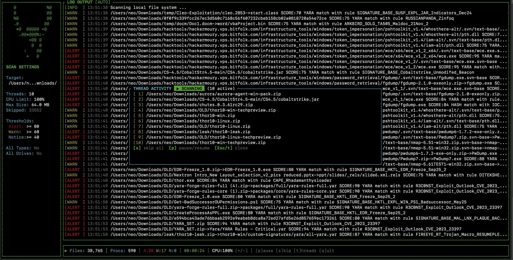

# Loki-RS

**Loki-RS** is a complete rewrite of the popular [Loki IOC and YARA Scanner](https://github.com/Neo23x0/Loki) in Rust. It is designed for performance, reliability, and ease of deployment, providing a single-binary solution for scanning systems for Indicators of Compromise (IOCs).

> **Status**: ⚠️ Beta. Active development. Not yet ready for production use.

## 🚀 Features

*   **High Performance**: Written in Rust for speed and memory safety.
*   **IOC Scanning**:
    *   **File Names**: Regex-based pattern matching on full file paths.
    *   **Hashes**: MD5, SHA1, and SHA256 scanning with optimized binary search.
    *   **C2 Connections**: Detects active network connections to known C2 servers (IP/Domain).
*   **YARA Scanning**:
    *   **File Content**: Scans files using compiled YARA rules.
    *   **Process Memory**: Scans memory of running processes (currently Linux-focused).
*   **Smart Filtering**:
    *   Skips system directories (e.g., `/proc`, `/sys`) and mounted drives by default.
    *   Ignores known false positives defined in signature sets.
    *   Checks file magic headers to identify executables even with wrong extensions.
*   **Scoring System**:
    *   Weighted scoring algorithm to prioritize relevant matches.
    *   Configurable thresholds for Alerts, Warnings, and Notices.

## 📥 Installation (Recommended)

The easiest way to use Loki-RS is to download the pre-compiled binary for your platform.

### 1. Download Release

Go to the [Releases Page](https://github.com/Neo23x0/Loki-RS/releases) and download the archive for your operating system:

*   **Linux**: `loki-linux-x86_64-vX.Y.Z.tar.gz` (or `aarch64` for ARM)
*   **Windows**: `loki-windows-x86_64-vX.Y.Z.zip`
*   **macOS**: `loki-macos-x86_64-vX.Y.Z.tar.gz` (or `aarch64` for Apple Silicon)

### 2. Setup Signatures

The release packages contain a set of signatures (IOCs and YARA rules) at the time of the release. However, **these signatures are likely outdated** by the time you download and extract the package.

We strongly encourage you to update the signatures immediately after extraction using the included `loki-util` tool.

```bash
# Extract the binary
tar -xzvf loki-linux-*.tar.gz
cd loki-linux-*

# Update signatures to the latest version
./loki-util update
```

This will download the latest IOCs and YARA rules into the `signatures/` directory.

### 3. Run

```bash
# Linux/macOS (requires root for full capabilities)
sudo ./loki --help

# Windows (Run as Administrator)
loki.exe --help
```

## 🛠️ Loki Util

The release package includes a utility tool named `loki-util` (or `loki-util.exe` on Windows) to help manage the installation.

### Commands

*   `update`: Updates the local signature base (IOCs and YARA rules) by downloading the latest versions from the repository.
    ```bash
    ./loki-util update
    ```
    *Note: Ensure you have internet access for this command to work.*

*   `upgrade`: Performs a full self-update (source build) if running from a git repository. (Not applicable for release binaries).

## 💻 Usage

### Common Commands

```bash
# Basic scan of the system (default behavior)
sudo ./loki

# Scan a specific folder
sudo ./loki --folder /tmp

# Scan with debug output
sudo ./loki --debug

# output logs to a JSONL file
sudo ./loki --jsonl scan_results.jsonl
```

### Command Line Options

| Option | Default | Description |
|--------|---------|-------------|
| `--folder <PATH>` | `/` | Folder to scan. |
| `--max-file-size <BYTES>` | `10000000` | Maximum file size to scan (10MB). |
| `--scan-all-files` | `false` | Scan all files regardless of extension/type. |
| `--scan-all-drives` | `false` | Scan all drives including mounted/network/cloud. |
| `--noprocs` | `false` | Skip process memory scanning. |
| `--nofs` | `false` | Skip filesystem scanning. |
| `--show-access-errors` | `false` | Show errors when accessing files/processes. |
| `--alert-level <SCORE>` | `80` | Score threshold for ALERT. |
| `--warning-level <SCORE>` | `60` | Score threshold for WARNING. |
| `--notice-level <SCORE>` | `40` | Score threshold for NOTICE. |
| `--max-reasons <NUM>` | `2` | Max number of match reasons to display per hit. |
| `--threads <NUM>` | `-2` | Number of threads. See [Threading](#threading). |
| `--tui` | `false` | Launch interactive TUI mode. See [TUI Mode](#️-tui-mode). |
| `--jsonl <FILE>` | `None` | Enable structured JSONL logging to file. |
| `--debug` | `false` | Show debug information. |
| `--trace` | `false` | Show verbose trace output. |
| `--version` | `false` | Show version and exit. |

### Threading

The `--threads` option controls how many parallel threads Loki uses for scanning.

| Value | Behavior |
|-------|----------|
| Positive (e.g., `4`) | Use exactly that many threads. |
| `0` | Use all available CPU cores. |
| `-1` | Use all cores minus 1 (leaves one core free). |
| `-2` | Use all cores minus 2 (default, leaves two cores free). |

On systems with 2 or fewer cores, negative values will always use at least 1 thread.

**Examples:**

```bash
# Low-resource systems (single-threaded, minimal CPU impact)
sudo ./loki --threads 1

# High-performance systems (use all available cores)
sudo ./loki --threads 0
```

## 🖥️ TUI Mode

Loki-RS includes an interactive Terminal User Interface (TUI) for real-time monitoring and control of scans.

### Launching the TUI

```bash
# Linux/macOS
sudo ./loki --tui --folder /path/to/scan

# Windows (Run as Administrator)
loki.exe --tui --folder C:\path\to\scan
```

### Features

The TUI provides:

*   **Real-time log output** with color-coded severity levels
*   **Live statistics** showing files scanned, alerts, warnings, and scan duration
*   **Scan settings panel** displaying current configuration
*   **Thread activity overlay** showing what each thread is currently processing
*   **Interactive controls** for pause/resume, skip, and CPU throttling

### Keyboard Shortcuts

| Key | Action |
|-----|--------|
| `q` | Quit the application |
| `p` | Pause/Resume the scan |
| `s` | Skip current elements (all threads) |
| `t` | Toggle thread activity overlay |
| `+` / `-` | Increase/Decrease CPU limit (5% steps) |
| `↑` / `↓` | Scroll log output |
| `Page Up` / `Page Down` | Scroll log output (fast) |
| `Home` / `End` | Jump to start/end of logs |
| `Space` | Toggle auto-scroll |

### Screenshots




## 📊 Scoring & Output

Loki-RS uses a weighted scoring system. Matches (YARA rules, IOCs) contribute to a total score for each file or process.

*   **ALERT** (Score ≥ 80): High probability of malicious activity.
*   **WARNING** (Score ≥ 60): Suspicious elements found.
*   **NOTICE** (Score ≥ 40): Interesting characteristics or low-confidence matches.

See [docs/score_calculation.md](docs/score_calculation.md) for details on the algorithm.

## 🛠️ Development / Build from Source

If you want to contribute or build the latest version yourself:

### Requirements
*   Rust toolchain (`rustc`, `cargo`)
*   Git

### Build Steps

```bash
# 1. Clone the repository
git clone https://github.com/Neo23x0/Loki-RS.git
cd Loki-RS

# 2. Build for release
cargo build --release

# 3. Get signatures
./target/release/loki-util update

# 4. Run
sudo ./target/release/loki
```

For detailed build instructions, including cross-compilation, see [docs/BUILD.md](docs/BUILD.md).

## 📂 Documentation

*   [Build Guide](docs/BUILD.md): Detailed build steps for all platforms.
*   [Score Calculation](docs/score_calculation.md): Explanation of the scoring formula.
*   [Parity Matrix](docs/parity_matrix.md): Comparison with Loki v1.

## 🖥️ Screenshots


## About the Author

Loki-RS is just a little private side-project of mine. By day, I work as the Head of Research at [Nextron Systems](https://www.nextron-systems.com/).

If you're looking for a full-featured enterprise-grade scanner, you should check out **THOR**. It comes with an immense feature set, robust testing, resource control features, and a huge detection rule set.

## ⚖️ License

Loki-RS is open-source software licensed under the [GNU General Public License v3.0](LICENSE).

Copyright (c) 2025 Florian Roth
