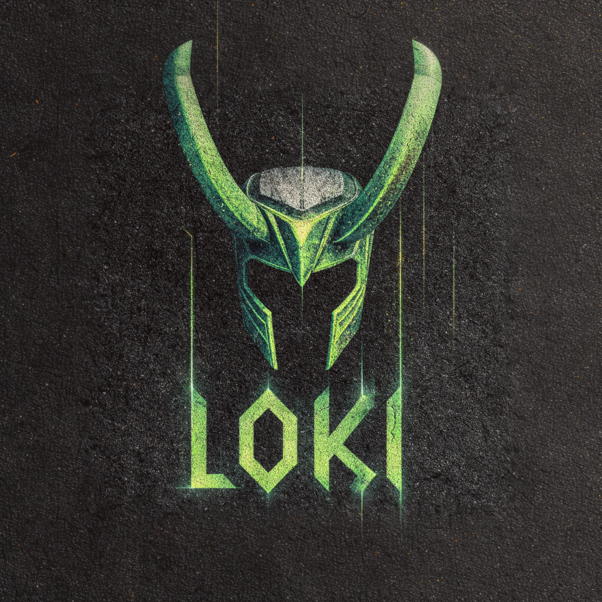
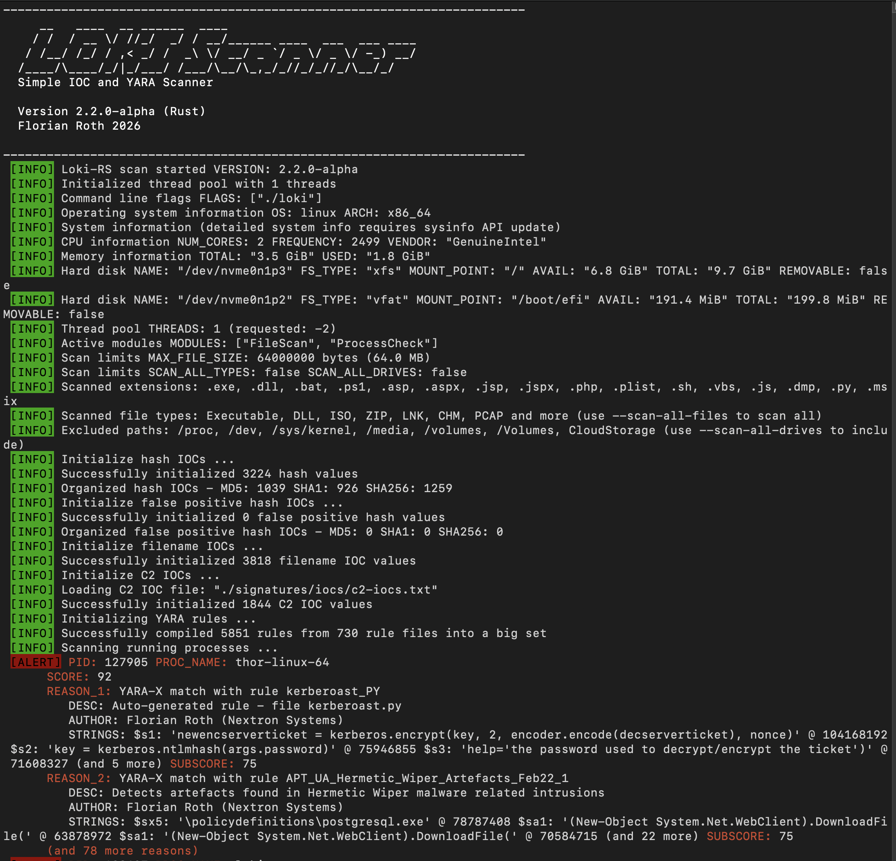
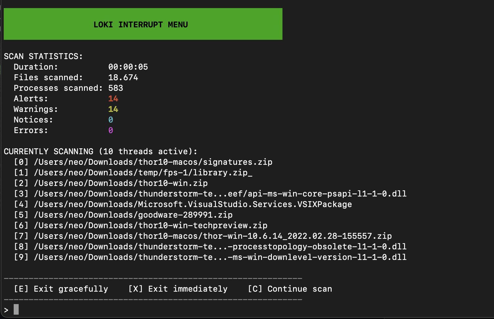
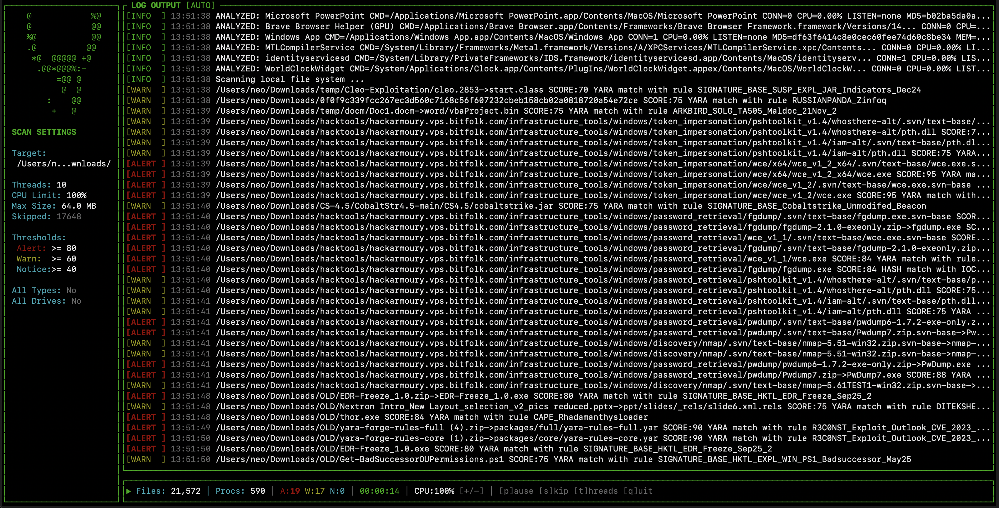
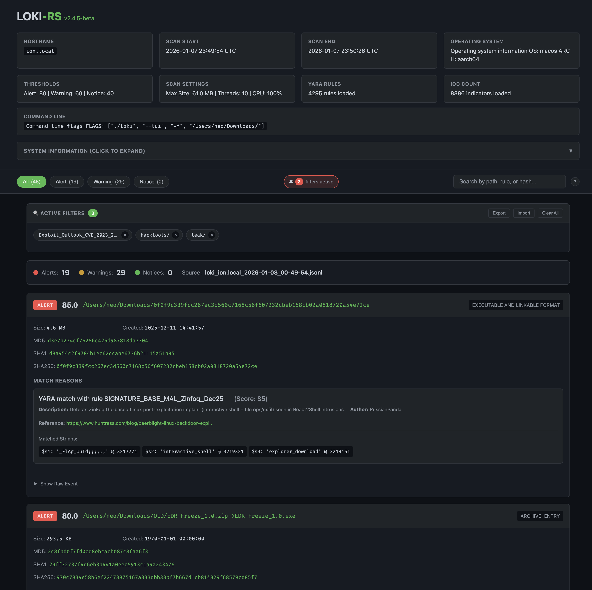

# Loki-RS

A rewrite of [Loki](https://github.com/Neo23x0/Loki) in Rust. High-performance, multi-threaded YARA & IOC scanner in a single binary.

**Status**: Beta. Works, but still under active development.

## Features

- YARA scanning of files and process memory (yara-x)
- IOC matching (MD5/SHA1/SHA256 hashes, filename patterns, C2 indicators)
- Multi-threaded scanning with configurable thread count
- Archive scanning (ZIP files)
- Interactive TUI with real-time stats and controls
- Remote logging via syslog (UDP/TCP) (SYSLOG/JSON)
- HTML report generation with detailed findings
- Configurable scoring thresholds
- Smart filtering (skips /proc, /sys, mounted drives by default)
- Magic header detection
- JSONL output for log ingestion

## macOS process scanning

Process memory scanning on macOS is best-effort and typically requires debugging entitlements or elevated privileges. Without those, Loki-RS will still scan files but will not be able to read most process memory. Use `--no-procs` to skip process scanning if needed.

## Installation

Download the pre-compiled binary for your platform from the [Releases Page](https://github.com/Neo23x0/Loki-RS/releases).

```bash
# Extract
tar -xzvf loki-linux-*.tar.gz
cd loki-linux-*

# Update signatures (recommended)
./loki-util update

# Run
sudo ./loki --help
```

Signatures ship with the release but get stale quickly. Run `loki-util update` to fetch the latest IOCs and YARA rules.

## Signatures

Loki-RS uses detection content from two sources:

**IOCs** are pulled from [signature-base](https://github.com/Neo23x0/signature-base), a collection of hash, filename, and C2 indicators maintained alongside Loki.

**YARA rules** come from [YARA Forge](https://yaraforge.com/), which aggregates and quality-checks rules from public repositories. Loki-RS uses the **Core** rule set - high accuracy, low false positives, optimized for performance. If you need broader coverage, you can swap in the Extended or Full sets from YARA Forge.

## Usage

```bash
# Basic scan (TUI enabled by default)
sudo ./loki

# Scan specific folder
sudo ./loki --folder /tmp

# Disable TUI, use standard command-line output
sudo ./loki --no-tui
```

## Common Scenarios

```bash
# Scan a mounted image (skip process scanning, use all cores)
sudo ./loki --no-procs --folder ~/image1 --threads 0

# Slow and cautious scan (lower CPU limit, single thread)
sudo ./loki --cpu-limit 60 --threads 1

# Scan and send logs to remote syslog
sudo ./loki --remote syslog-host.internal:514 --remote-proto udp
```

## Screenshots





## Command Line Options

### Scan Target
| Option | Default | Description |
|--------|---------|-------------|
| `-f, --folder <PATH>` | `/` | Folder to scan |

### Scan Control
| Option | Default | Description |
|--------|---------|-------------|
| `--no-procs` | `false` | Skip process memory scanning |
| `--no-fs` | `false` | Skip filesystem scanning |
| `--no-archive` | `false` | Skip scanning inside archives (ZIP) |
| `--scan-all-drives` | `false` | Scan all drives including mounted/network/cloud |
| `--scan-all-files` | `false` | Scan all files regardless of extension/type |

### Output Options
| Option | Default | Description |
|--------|---------|-------------|
| `-l, --log <FILE>` | auto | Plain text log file |
| `--no-log` | `false` | Disable plaintext log output |
| `-j, --jsonl <FILE>` | auto | JSONL output file |
| `--no-jsonl` | `false` | Disable JSONL output |
| `--no-html` | `false` | Disable HTML report generation |
| `--no-tui` | `false` | Disable TUI, use standard command-line output |
| `-r, --remote <HOST:PORT>` | none | Remote syslog destination |
| `-p, --remote-proto <PROTO>` | `udp` | Remote protocol (udp/tcp) |
| `--remote-format <FMT>` | `syslog` | Remote format (syslog/json) |

### Tuning
| Option | Default | Description |
|--------|---------|-------------|
| `--alert-level <SCORE>` | `80` | Score threshold for ALERT |
| `--warning-level <SCORE>` | `60` | Score threshold for WARNING |
| `--notice-level <SCORE>` | `40` | Score threshold for NOTICE |
| `--max-reasons <NUM>` | `2` | Max match reasons to display per finding |
| `-m, --max-file-size <BYTES>` | `64000000` | Maximum file size to scan (64MB) |
| `-c, --cpu-limit <PERCENT>` | `100` | CPU utilization limit (1-100) |
| `--threads <NUM>` | `-2` | Number of threads (0=all, -1=all-1, -2=all-2) |

### Info & Debug
| Option | Default | Description |
|--------|---------|-------------|
| `--version` | - | Show version and exit |
| `-d, --debug` | `false` | Show debug output |
| `--trace` | `false` | Show verbose trace output |
| `--show-access-errors` | `false` | Show file/process access errors |

## TUI Mode

The terminal interface is enabled by default and provides real-time monitoring during scans.

```bash
sudo ./loki --folder /path/to/scan
```


| Key | Action |
|-----|--------|
| `q` | Quit |
| `p` | Pause/Resume |
| `s` | Skip current items |
| `t` | Toggle thread overlay |
| `+` / `-` | Adjust CPU limit |
| Arrow keys | Scroll logs |



## HTML Reports

Loki-RS automatically generates a styled HTML report after each scan. The report is created alongside the JSONL log file and provides a visual summary of all findings.

The report includes:
- Scan configuration and runtime statistics
- Color-coded findings grouped by severity (Alert, Warning, Notice)
- File metadata (hashes, timestamps, size)
- YARA rule matches with descriptions and matched strings
- IOC match details with references



The HTML report shares the same base filename as the JSONL output (e.g., `loki_hostname_2025-01-08.html`). To disable report generation, use `--no-html`.

### Generating HTML Reports from JSONL Files

You can generate HTML reports from existing JSONL files using `loki-util`:

```bash
# Generate HTML report from a single JSONL file
./loki-util html --input scan_results.jsonl --output report.html

# Generate combined HTML report from multiple JSONL files
./loki-util html --input "*.jsonl" --combine --output combined_report.html

# Use glob patterns to match multiple files
./loki-util html --input "/path/to/scans/*.jsonl" --combine --output combined.html
```

**Options:**
- `--input <file|glob>` - Input JSONL file or glob pattern (required)
- `--output <file.html>` - Output HTML file (optional, defaults to input filename with .html extension)
- `--combine` - Combine multiple JSONL files into one report (groups findings by hostname)
- `--title <str>` - Override report title
- `--host <str>` - Override hostname in report

The combined report mode is useful for aggregating scan results from multiple hosts or time periods into a single view, with findings grouped by source hostname.

## Building from Source

```bash
git clone https://github.com/Neo23x0/Loki-RS.git
cd Loki-RS
cargo build --release
./target/release/loki-util update
sudo ./target/release/loki
```

Requires Rust toolchain. See [docs/BUILD.md](docs/BUILD.md) for cross-compilation.

## Documentation

- [Build Guide](docs/BUILD.md)
- [Score Calculation](docs/score_calculation.md)
- [Parity Matrix](docs/parity_matrix.md)

## About

Loki RS is a side project. It’s a fast, single-binary scanner built for practical triage and experimentation, and it may change quickly as ideas get tried and removed.

Support is community-based and best-effort - no SLA, no guaranteed response times, and no promise that every edge case is handled perfectly. If you run it in production, do it with that in mind.

For corporate environments and incident response work with predictable support and a broader, well-tested feature set, Nextron Systems maintains [THOR](https://www.nextron-systems.com/) (and THOR Lite). THOR is the professional scanner with extensive artifact coverage, more modules and formats, and vendor support. THOR Lite is the free entry version with a reduced scope.

## License

GNU General Public License v3.0. See [LICENSE](LICENSE).

Copyright (c) 2025 Florian Roth
